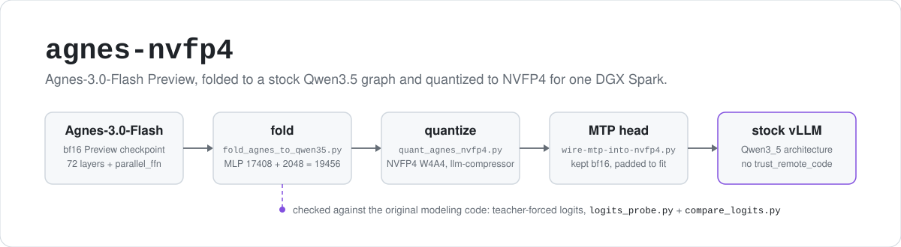

<p align="center">
  <picture>
    <source media="(prefers-color-scheme: dark)" srcset="assets/hero-dark.svg">
    
  </picture>
</p>

<p align="center">
  
  
  <a href="https://huggingface.co/CocaKova/Agnes-3.0-Flash-Preview-NVFP4"></a>
</p>

These are the scripts that turned the open-weight **Preview** checkpoint of
[Agnes-AI/Agnes-3.0-Flash](https://huggingface.co/Agnes-AI/Agnes-3.0-Flash) into an NVFP4 build
that runs in stock vLLM on one NVIDIA DGX Spark. Agnes-3.0-Flash is the Qwen3.5-27B architecture
with one extra piece per layer, so it normally needs `trust_remote_code` or a patched server. The
fold script rewrites it as a plain `Qwen3_5ForConditionalGeneration` checkpoint, the quantization
script takes that to NVFP4 (W4A4, group 16) with llm-compressor, and two small scripts put the
bf16 MTP draft head back so speculative decoding works. The rest of the repo is the probes used
to check each step.

The finished weights are on Hugging Face:
[CocaKova/Agnes-3.0-Flash-Preview-NVFP4](https://huggingface.co/CocaKova/Agnes-3.0-Flash-Preview-NVFP4)
(61.6 GiB bf16 down to 22.0 GiB). Its model card is kept here as [`README-card.md`](README-card.md).

## Quick start: serve the published build

On one DGX Spark with a vLLM build that supports NVFP4 on sm_121a (this was run on a local
0.20.2rc1 tree, see [Limitations](#limitations)):

```bash
vllm serve CocaKova/Agnes-3.0-Flash-Preview-NVFP4 \
  --served-model-name agnes-3.0-flash \
  --max-model-len 131072 --kv-cache-dtype bfloat16 \
  --speculative-config '{"method":"mtp","num_speculative_tokens":3}' \
  --enable-auto-tool-choice --tool-call-parser qwen3_xml --reasoning-parser deepseek_r1
```

The chat template is Agnes's own. Pass `chat_template_kwargs: {"reasoning_effort": "low"|"medium"|"xhigh"}`
(default `xhigh`, set it lower for agent work), or `enable_thinking: false` to turn reasoning off.

[`serve_agnes_nvfp4.sh`](serve_agnes_nvfp4.sh) is the script used for the measurements below. It serves
a local copy on `127.0.0.1:8001` and takes `MODEL`, `PORT`, `UTIL` (default `0.55`), `MAXLEN` (default
`131072`), `SPEC_N` (MTP draft tokens, default `3`, `0` turns MTP off) and `LOG` from the environment.
It sources a local vLLM environment file, so edit that line before you use it.

## How the build works

### 1. Fold to a stock Qwen3.5 graph

Agnes-3.0-Flash is Qwen3.5-27B's architecture (gated delta rule 3:1 with gated full attention,
mRoPE, the same vision tower, one MTP layer) with 72 layers and one addition: a second, narrower
SwiGLU per layer (`parallel_ffn`, 2048 wide) whose output is added to the main MLP. Two SwiGLUs on
the same input, summed, are one wider SwiGLU:

```
down(silu(gate x) * up x) + down2(silu(gate2 x) * up2 x)
  = [down | down2] @ (silu([gate; gate2] x) * ([up; up2] x))
```

So [`fold_agnes_to_qwen35.py`](fold_agnes_to_qwen35.py) concatenates gate/up along the output dim and
down along the input dim, and `intermediate_size` becomes 17408 + 2048 = 19456. It also renames
`delta_attn` to `linear_attn` and `global_attn` to `self_attn` (the same fold the model's bundled
SGLang patch applies at load time), rewrites `config.json` in Qwen3.5 terms and copies the tokenizer,
processor configs and `LICENSE`. It streams tensor by tensor and flushes a shard every `FLUSH_GIB`
(default 3) GiB, so peak RAM stays low.

```bash
python3 fold_agnes_to_qwen35.py <agnes_bf16_dir> <folded_bf16_dir>
```

**Check:** teacher-forced logits on the same 242 tokens ([`probe_text.txt`](probe_text.txt)), original
checkpoint through its bundled `modeling_agnes.py` (transformers 5.12.1) against the folded checkpoint
through stock `Qwen3_5ForConditionalGeneration` (transformers 5.10.1): mean KL 5.0e-3, argmax agreement
99.2%, perplexity 164.3 vs 163.0.

```bash
python3 logits_probe.py agnes  <agnes_bf16_dir>  orig.pt    # needs transformers >= 5.12
python3 logits_probe.py qwen35 <folded_bf16_dir> folded.pt
python3 compare_logits.py orig.pt folded.pt
```

`logits_probe.py` runs on CPU by default (`PROBE_DEVICE`, `PROBE_THREADS`).
[`ref_logits_docker.sh`](ref_logits_docker.sh) is how the first line was run here, inside a local vLLM
image, because the quantization venv had an older transformers.

### 2. Quantize to NVFP4

[`quantize.sh`](quantize.sh) runs [`quant_agnes_nvfp4.py`](quant_agnes_nvfp4.py), copies the tokenizer and
processor files over, then runs [`wire-mtp-into-nvfp4.py`](wire-mtp-into-nvfp4.py). Its own note says it
needs about 70 GiB free.

- llm-compressor `QuantizationModifier`, scheme `NVFP4`, targets `Linear`.
- Calibration: `N_CAL` (default 32) samples of up to `MAX_SEQ` (default 4096) tokens from
  `HuggingFaceH4/ultrachat_200k`, rendered with the chat template.
- Kept in bf16: `lm_head`, the vision tower, the delta-rule `conv1d`, and everything under `mtp`.
- The model is loaded explicitly as `Qwen3_5ForConditionalGeneration`. Letting `oneshot()` pick the class
  gives the text-only `Qwen3_5ForCausalLM`, which silently drops the vision tower. The script aborts if it
  finds no vision parameters.

### 3. Put the MTP head back

transformers' `Qwen3_5ForConditionalGeneration` has no MTP submodule, so quantization always drops the
15 `mtp.*` tensors. `wire-mtp-into-nvfp4.py` lifts them from the folded bf16 source into
`model-mtp-bf16.safetensors`, rebuilds the index, and adds the MTP modules to
`quantization_config.ignore`. That ignore list matters: if the server treats the bf16 draft head as
NVFP4, MTP acceptance drops to 0% and decoding gets slower than with no MTP at all.

The original MTP layer has no parallel branch, so its SwiGLU is still 17408 wide while vLLM sizes the
draft MLP from `intermediate_size` (19456). [`pad_mtp_mlp.py`](pad_mtp_mlp.py) zero-pads it, which is exact
(`silu(0) * 0 = 0`). `quantize.sh` does **not** run this step, so run it yourself afterwards:

```bash
python3 pad_mtp_mlp.py <nvfp4_dir> 19456
```

### 4. Check the served model

These scripts talk to a running server at `127.0.0.1:8001` with model name `agnes-3.0-flash`
(the defaults of `serve_agnes_nvfp4.sh`) and score text with `prompt_logprobs`:

| script | what it measures |
|---|---|
| [`assistant_probe.py`](assistant_probe.py) | `gen`: greedy answers to three fixed prompts. `score`: perplexity of those answer tokens under whichever model is being served |
| [`raw_probe.py`](raw_probe.py) | perplexity on three untemplated texts (counting, the Apache license paragraph, short factual prose) |
| [`vllm_collect_logprobs.py`](vllm_collect_logprobs.py) | served logprobs on the same tokens as `logits_probe.py` |
| [`vllm_ppl_probe.py`](vllm_ppl_probe.py) | served logprobs compared with a saved bf16 logits file from `logits_probe.py` |

## Results

Numbers from the model card ([`README-card.md`](README-card.md)), measured on one DGX Spark.

<details>
<summary>Quality: teacher-forced perplexity, bf16 vs NVFP4, same vLLM engine</summary>

The assistant-token row is the bf16 model's own greedy answers to three prompts (2,001 tokens), scored
under each model. Those are the only positions an SFT model is trained on.

| text | bf16 (folded, vLLM) | NVFP4 (this build) |
|---|---|---|
| assistant tokens (bf16 greedy answers, 2,001 tok) | 1.131 | 1.259 |
| raw prose (facts, 58 tok) | 2.836 | 2.984 |
| Apache license paragraph (87 tok) | 1.099 | 1.149 |
| counting 1..30 (108 tok) | 1.108 | 1.131 |

Greedy answers from the two models diverge early, as 4-bit builds do, but reached the same
conclusions on the test prompts (π(200) = 46, a correct merge function with tests). Tool calling
(`qwen3_xml` parser) and reasoning (`<think>`) were checked end to end.

Don't score system or user tokens. SFT never trains on them, both models are near random there, and
the numbers mean nothing (bf16 read 160 ppl on a user prompt, NVFP4 68, and neither is "better").

</details>

<details>
<summary>Speed: single stream, thinking off</summary>

| | |
|---|---|
| decode, no speculation | 10.6 tok/s (memory-bandwidth floor for ~20 GB of weights) |
| decode, MTP k=3, prose | 15 tok/s (acceptance length about 3.4) |
| decode, MTP k=3, code | 21 tok/s |
| decode, MTP k=3, highly predictable text | 26 tok/s (acceptance about 4.0) |
| cold prefill, 31k-token prompt | 1,650 tok/s |
| KV cache at `--gpu-memory-utilization 0.35` | 206k tokens (bf16 KV) |

vLLM tree built for sm_121a, `FlashInferCutlassNvFp4LinearKernel`, Triton/FLA GDN kernels, flashinfer
attention.

</details>

## Limitations

- **These are the scripts as they were run on one machine.** Input, output, venv and log paths are
  hardcoded to that machine's home directory in `quantize.sh`, `quant_agnes_nvfp4.py`,
  `serve_agnes_nvfp4.sh` and `ref_logits_docker.sh`, and as defaults in `fold_agnes_to_qwen35.py`.
  Edit them before running anything.
- `serve_agnes_nvfp4.sh` sources a local vLLM build (a 0.20.2rc1 tree for sm_121a), and
  `ref_logits_docker.sh` runs a locally tagged vLLM image. Neither is published here.
- Tested on one DGX Spark (GB10) only. Nothing else has been tried.
- This is the Preview open-weight checkpoint, not the production/API Agnes 3.0 Flash.
- No tests and no CI. The checks are the probe scripts above, run by hand.

## License

This repo has no license file yet. The upstream model,
[Agnes-AI/Agnes-3.0-Flash](https://huggingface.co/Agnes-AI/Agnes-3.0-Flash), is Apache-2.0 per its
Hugging Face card, and the published NVFP4 weights are tagged Apache-2.0 on theirs. The fold script
copies the upstream `LICENSE` file into the output.

A personal project. Not affiliated with or endorsed by Agnes AI or NVIDIA.
